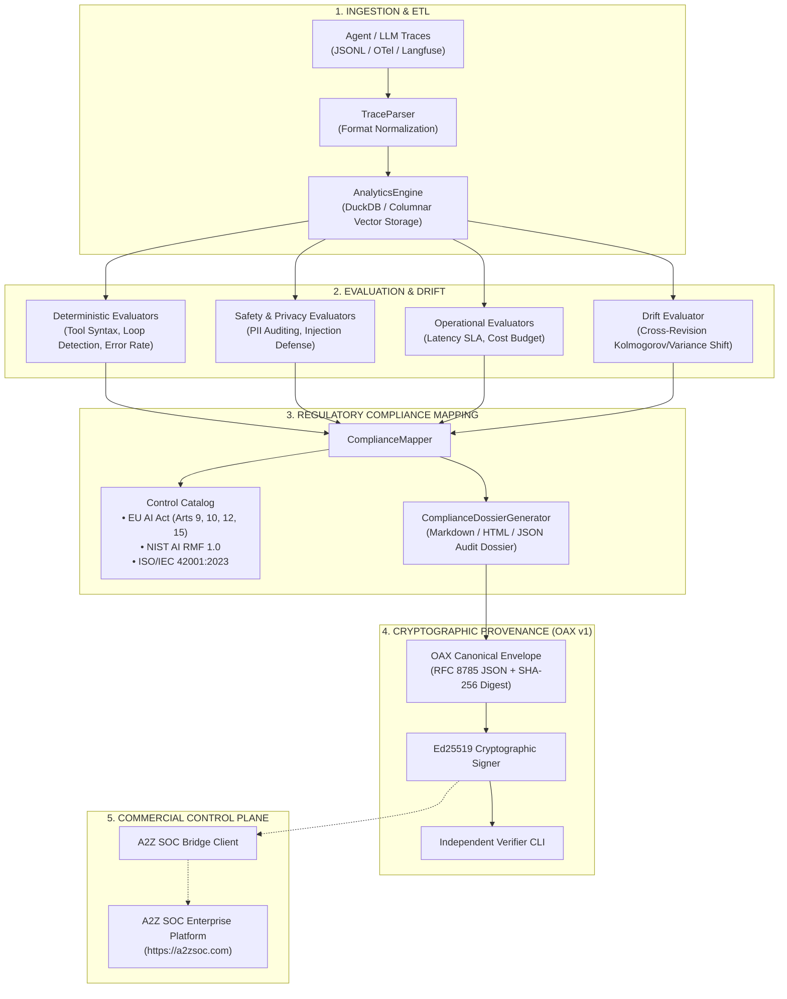

# System Architecture: EvalLake (OpenAssurance-AI)

EvalLake connects high-speed analytical data pipelines with cryptographic audit verification and regulatory compliance frameworks.

---

## Technical Invariants
1. **Zero External Dependencies Required:** Base evaluations, columnar queries, and RFC 8032 Ed25519 signing execute on standard Python 3.10+ runtimes.
2. **Columnar Acceleration:** When `duckdb` or `pyarrow` is installed, analytical queries run with vector processing speed.
3. **Cryptographic Tamper-Evidence:** Any byte altered in an evaluation record invalidates the SHA-256 digest and Ed25519 signature.
4. **Direct Regulatory Crosswalk:** Technical engineering metrics directly map into legal requirements for conformity assessments.
